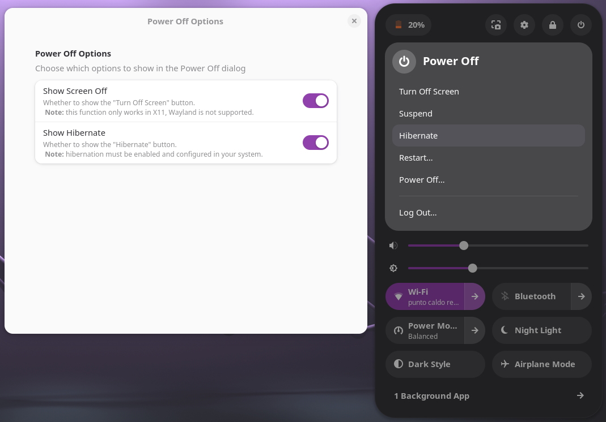

# Power Off Options

Power Off Options is a GNOME Shell extension that adds two additional buttons to the Power Off dialog:

- **Turn Off Screen** — Immediately turn off the monitor/display.
- **Hybrid Sleep** — Suspend to RAM and also save system state to disk (safe on power loss).
- **Suspend Then Hibernate** — Suspend the system to RAM and automatically hibernate after a timeout.
- **Hibernate** — Save system state to disk and power off (slower to resume than suspend).
- **Restart user space (Soft Reboot)** — Restart the user space without rebooting the entire system.
- **Restart To BIOS** — Reboot directly into the system BIOS setup.


<p align="center">
  
</p>


## Requirements

- GNOME Shell;
- the screen off function only works in X11, Wayland is not supported;
- Hibernation, Hybrid Sleep and Reboot related options make use of `systemctl` respective commands and must be enabled and configured in your system to work properly.

## Installation

Install from the GNOME Extensions website:  
<https://extensions.gnome.org/extension/8189/power-off-options/> 

Otherwise it can be installed manually:
1. download or clone this repository;
2. move into the extension directory;
3. run:
    - `make` to install the extension;
    - `make uninstall` to uninstall the extension;
4. restart GNOME Shell to apply the changes (e.g. log out and log back in).

## Preferences

You can enable or disable each button individually using the built-in preferences window:

```bash
gnome-extensions prefs power-off-options@axelitama.github.io
```

The same window is also accessible from the **GNOME Extensions** application.
