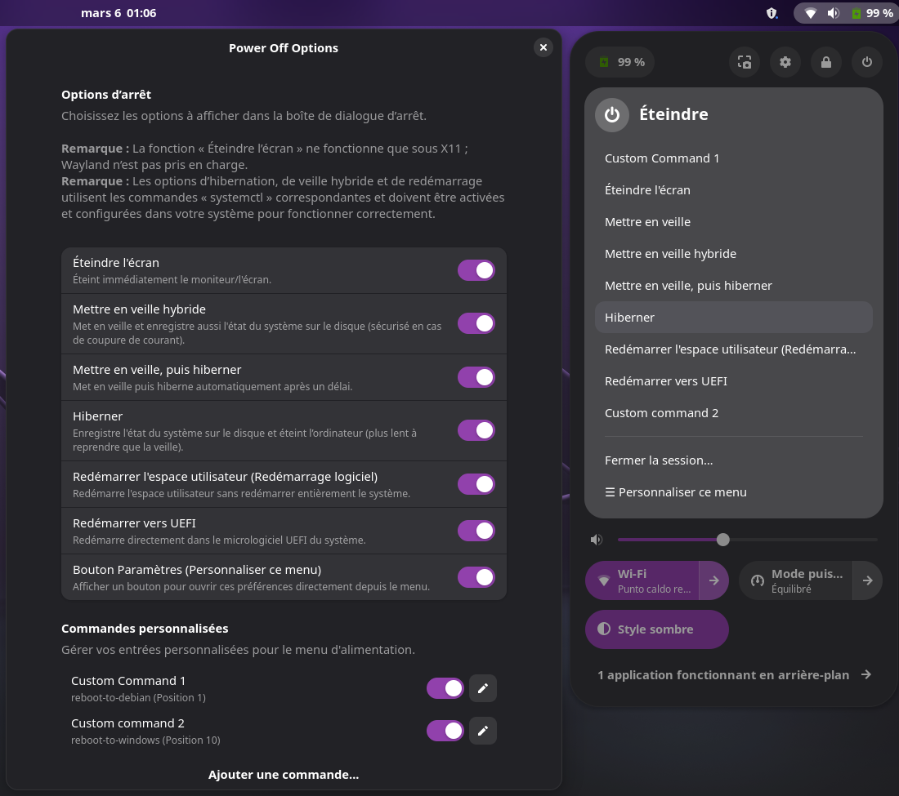

# Power Off Options

Power Off Options est une extension **GNOME Shell** qui ajoute des boutons supplémentaires à la boîte de dialogue d’extinction :

- **Éteindre l’écran** — Éteint immédiatement le moniteur/l’écran.
- **Veille hybride** — Met le système en veille (RAM) tout en enregistrant également l’état du système sur le disque (sécurisé en cas de coupure de courant).
- **Veille puis hibernation** — Met le système en veille et passe automatiquement en hibernation après un certain délai.
- **Hibernation** — Sauvegarde l’état du système sur le disque et éteint l’ordinateur (la reprise est plus lente que la veille).
- **Redémarrer l’espace utilisateur (Redémarrage doux)** — Redémarre uniquement l’espace utilisateur sans redémarrer complètement le système.
- **Redémarrer dans le BIOS** — Redémarre directement dans le BIOS/UEFI du système.
- **Commandes personnalisées** — Ajoutez vos propres commandes via la fenêtre des préférences. Les commandes personnalisées vous permettent d’ajouter des entrées au menu d’alimentation pour exécuter n’importe quelle commande shell.

<p align="center">
  
</p>

## Prérequis

- GNOME Shell ;
- la fonction d’extinction de l’écran ne fonctionne que sous X11 (Wayland non pris en charge) ;
- les options relatives à l’hibernation, la veille hybride et le redémarrage utilisent les commandes correspondantes de `systemctl` et doivent être activées et correctement configurées sur votre système pour fonctionner.

## Installation

Installez depuis le site officiel des extensions GNOME :  
<https://extensions.gnome.org/extension/8189/power-off-options/>

Sinon, vous pouvez l’installer manuellement :

1. Téléchargez ou clonez ce dépôt ;
2. accédez au dossier de l’extension ;
3. exécutez :  
   - `make` pour installer l’extension ;
   - `make uninstall` pour la désinstaller ;
4. redémarrez GNOME Shell pour appliquer les changements (par exemple, déconnectez-vous puis reconnectez-vous).

## Préférences

Vous pouvez activer ou désactiver individuellement chaque bouton via la fenêtre intégrée des préférences :

```bash
gnome-extensions prefs power-off-options@axelitama.github.io
```

La même fenêtre est également accessible depuis l’application **GNOME Extensions**.
