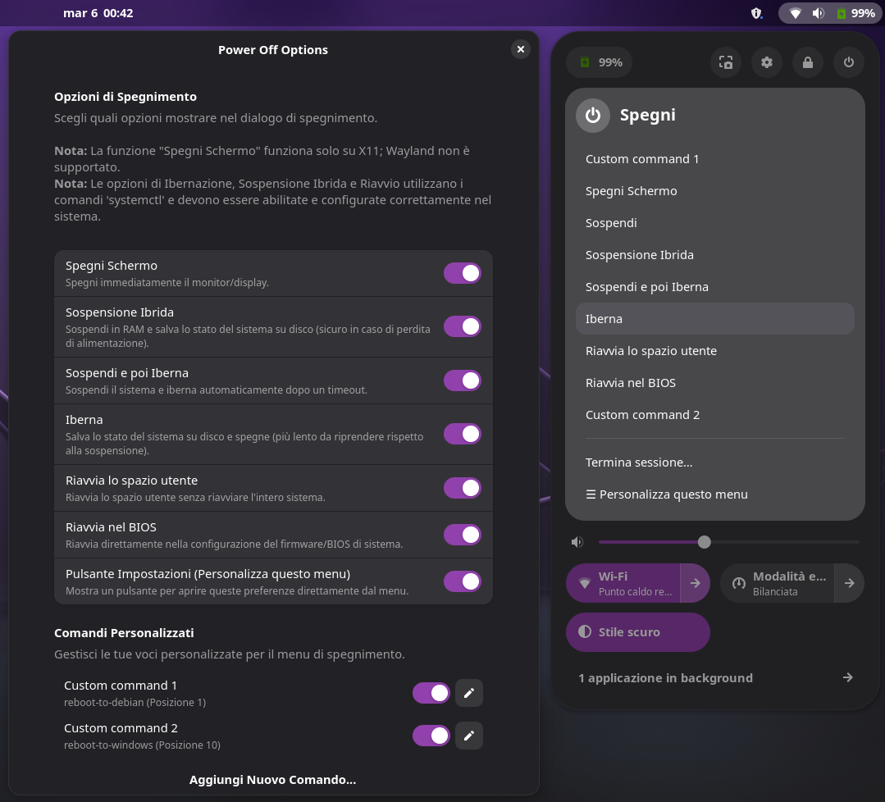

# Power Off Options

Power Off Options è un’estensione per **GNOME Shell** che aggiunge pulsanti aggiuntivi alla finestra di dialogo di spegnimento:

- **Spegni Schermo** — Spegne immediatamente il monitor/display.
- **Sospensione Ibrida** — Sospende il sistema in RAM e salva anche lo stato su disco (sicura in caso di perdita di alimentazione).
- **Sospendi poi Iberna** — Sospende il sistema in RAM e lo iberna automaticamente dopo un certo intervallo di tempo.
- **Iberna** — Salva lo stato del sistema su disco e spegne il computer (ripristino più lento rispetto alla sospensione).
- **Riavvia Spazio Utente** — Riavvia solo lo spazio utente senza riavviare completamente il sistema.
- **Riavvia nel BIOS** — Riavvia direttamente il computer accedendo al BIOS.
- **Comandi Personalizzati** — Aggiungi i tuoi comandi personalizzati tramite la finestra delle preferenze. I comandi personalizzati permettono di aggiungere voci al menu di spegnimento con qualsiasi comando shell tu voglia eseguire.

<p align="center">
  
</p>

## Requisiti

- GNOME Shell;
- la funzione di spegnimento dello schermo funziona solo in X11, Wayland non è supportato;
- le opzioni relative a Ibernazione, Sospensione Ibrida e Riavvio utilizzano i rispettivi comandi `systemctl` e devono essere abilitate e configurate correttamente nel sistema per funzionare.

## Installazione

Installa dal sito ufficiale delle estensioni GNOME:
<https://extensions.gnome.org/extension/8189/power-off-options/>

In alternativa, è possibile installarla manualmente:

1. Scarica o clona questo repository;
2. entra nella directory dell’estensione;
3. esegui:  
   - `make` per installare l’estensione;
   - `make uninstall` per disinstallarla;
4. riavvia GNOME Shell per applicare le modifiche (ad esempio, disconnettiti e riconnettiti).

## Preferenze

Puoi abilitare o disabilitare singolarmente ciascun pulsante tramite la finestra delle preferenze integrata:

```bash
gnome-extensions prefs power-off-options@axelitama.github.io
```

La stessa finestra è accessibile anche dall’applicazione **GNOME Extensions**.
