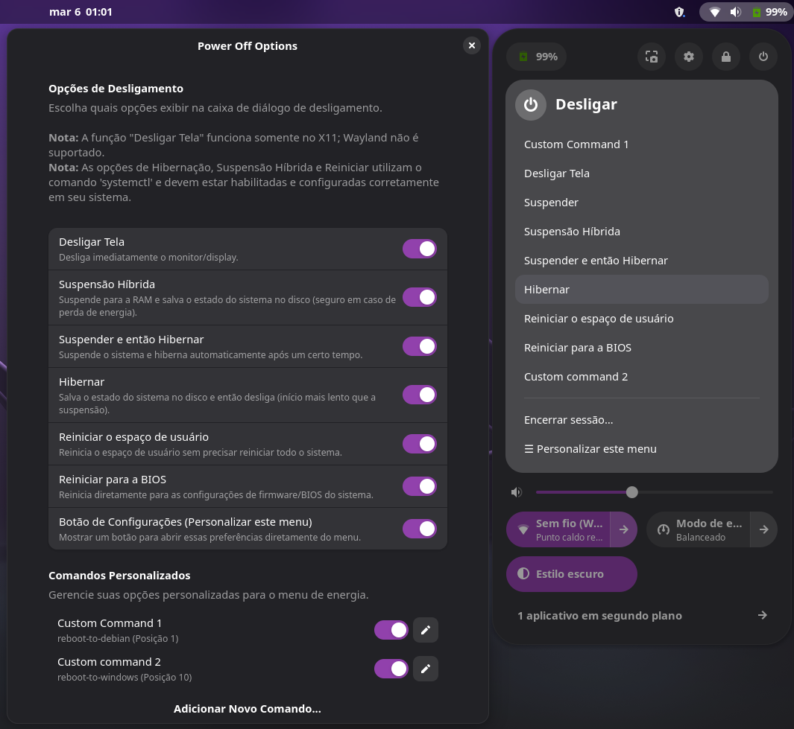

# Power Off Options

Power Off Options é uma extensão do **GNOME Shell** que inclui opções adicionais na caixa de diálogo de desligamento:

- **Desligar Tela** — Desliga imediatamente o monitor/display.
- **Suspensão Híbrida** — Suspende para a RAM e salva o estado do sistema no disco (seguro em caso de perda de energia).
- **Suspende e então Hiberna** — Suspende o sistema e hiberna automaticamente após um certo tempo.
- **Hibernar** — Salva o estado do sistema no disco e então desliga (início mais lento que a suspensão).
- **Reiniciar o espaço de usuário** — Reinicia o espaço de usuário sem precisar reiniciar todo o sistema.
- **Reiniciar para a BIOS** — Reinicia diretamente para as configurações de firmware/BIOS do sistema.
- **Comandos Personalizados** — Adicione seus próprios comandos através da janela de preferências. Comandos personalizados permitem incluir novas opções no menu de energia com qualquer comando de shell que você desejar executar.

<p align="center">
  
</p>

## Requisitos

- GNOME Shell;
- a função de desligar tela funciona somente no X11, Wayland não é suportado;
- as opções de Hibernação, Suspensão Híbrida e Reiniciar utilizam o comando `systemctl` e devem estar habilitadas e configuradas corretamente em seu sistema.

## Instalação

Instale pelo site oficial do GNOME Extensions:
<https://extensions.gnome.org/extension/8189/power-off-options/>

Alternativamente, você pode instalar manualmente:

1. baixe ou clone este repositório;
2. entre no diretório da extensão;
3. rode:  
   - `make` para instalar a extensão;
   - `make uninstall` para desinstalá-la;
4. Reinicie o GNOME Shell para aplicar as mudanças (por exemplo, sair e se logar novamente).

## Preferências

Você pode habilitar ou desabilitar cada botão separadamente na janela de preferências integrada: 

```bash
gnome-extensions prefs power-off-options@axelitama.github.io
```

A mesma janela é acessível a partir da aplicação **GNOME Extensions**.
