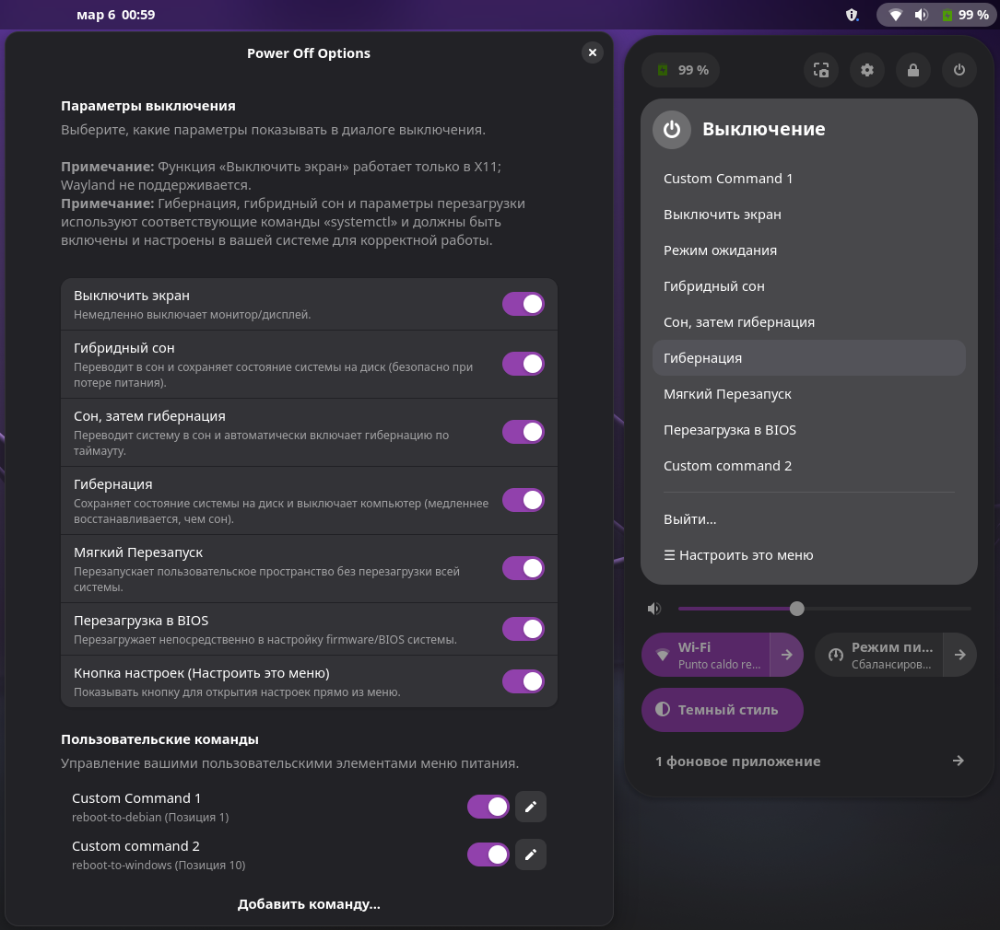

# Power Off Options

Power Off Options — это расширение GNOME Shell, которое добавляет дополнительные кнопки в диалог выключения:

- **Выключить экран** — Немедленно выключить монитор/дисплей.
- **Гибридный сон** — Перевести в сон RAM и также сохранить состояние системы на диск (безопасно при потере питания).
- **Сон, затем гибернация** — Перевести систему в сон RAM и автоматически перейти в гибернацию после таймаута.
- **Гибернация** — Сохранить состояние системы на диск и выключить (медленнее возобновляется, чем сон).
- **Перезапуск пользовательского пространства (Мягкая перезагрузка)** — Перезапустить пользовательское пространство без перезагрузки всей системы.
- **Перезагрузка в BIOS** — Перезагрузить напрямую в настройку системной firmware/BIOS.
- **Пользовательские команды** — Добавьте свои собственные команды в меню питания.

<p align="center">
  
</p>

## Требования

- GNOME Shell;
- функция выключения экрана работает только в X11, Wayland не поддерживается;
- Гибернация, гибридный сон и связанные с перезагрузкой опции используют соответствующие команды `systemctl` и должны быть включены и настроены в вашей системе для исправной работы.

## Установка

Установите с сайта расширений GNOME:
<https://extensions.gnome.org/extension/8189/power-off-options/>

Или установите вручную:

1. скачайте или клонируйте этот репозиторий;
2. перейдите в каталог расширения;
3. выполните:
   - `make` для установки расширения;
   - `make uninstall` для удаления расширения;
4. перезапустите GNOME Shell для применения изменений (например, выйдите из системы и войдите снова).

## Настройки

Вы можете включать или отключать каждую кнопку индивидуально через встроенное окно настроек:

```bash
gnome-extensions prefs power-off-options@axelitama.github.io
```

То же окно также доступно из приложения **GNOME Extensions**.
