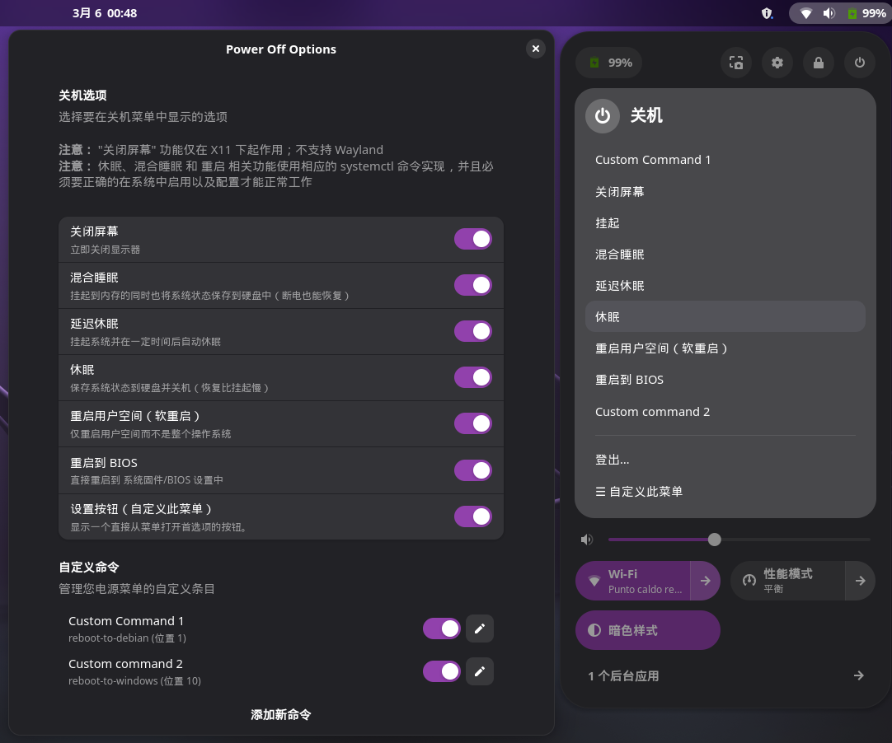

# Power Off Options

Power Off Options 是一个用于向电源菜单添加额外选项的 GNOME Shell 扩展：

- **关闭屏幕** — 立即关闭显示器
- **混合睡眠** — 挂起到内存的同时也将系统状态保存到硬盘中（断电也能恢复）
- **延迟休眠** — 挂起系统并在一定时间后自动休眠
- **休眠** — 保存系统状态到硬盘并关机（恢复比挂起慢）
- **重启用户空间（软重启）** — 仅重启用户空间而不是整个操作系统
- **重启到 BIOS** — 直接重启到 BIOS 设置中
- **自定义命令** — 通过设置窗口添加您的自定义命令，自定义命令允许您向电源菜单添加条目用于执行任何 shell 命令

<p align="center">
  
</p>

## 要求

- GNOME Shell
- "关闭屏幕" 功能仅在 X11 下起作用，不支持 Wayland
- 休眠、混合睡眠 和 重启 相关功能使用相应的 systemctl 命令实现，并且必须要正确的在系统中启用以及配置才能正常工作

## 安装

直接从 GNOME Extensions 网站安装:  
<https://extensions.gnome.org/extension/8189/power-off-options/> 

或者手动安装:

1. 下载或者克隆这个代码仓库
2. 移动到扩展文件夹之中
3. 执行:
    - `make` 安装扩展
    - `make uninstall` 卸载扩展
4. 重启 GNOME Shell 使改变生效 (例如登出再登入)

## 设置

你可以通过扩展的设置窗口单独启用或者禁用每一个按钮:

```bash
gnome-extensions prefs power-off-options@axelitama.github.io
```

这个窗口同样也可以从 **GNOME Extensions** 应用打开。
